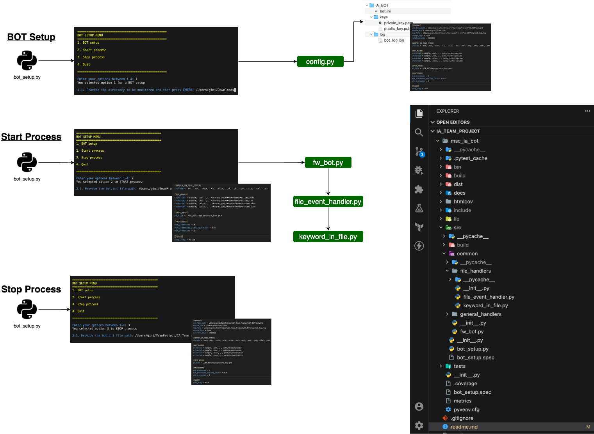

# Digital File Monitoring BOT


The BOT is responsible to Monitor, Retrieve and Process the Source Directory based on a Configuration ini file as the input.
This input is required with proper definitions about the keywords and/or file-types so that the data can be used to move the files to respective directories so that they can be given for further analysis.

## Executable

An executable "bot_setup" is provided that is bundled with all dependencies for most of the operating systems. This can be found at <a href="dist" target="_blank">Github: dist</a>.

## Installation

A minimum Python 3.10 version will be required. The project uses Python 3.10.11 and pip 23.1.2. It is recommended to install to a virtual environment. A summary of the installation steps would be:

- Download or clone.
- Create a virtual environment.

```bash
$ pip3 install virtualenv
$ python3 -m aVirtualEnvName
$ source aVirtualEnvName/bin/activate
```

- Make sure the code is placed in the environment (ex; aVirtualEnvName) directory.
- Install the dependencies. All the dependencies can be found in the project as <a href="requirements-dev.txt">Github: requirements-dev.txt</a>. Make sure your virtual environment has been activated.

```bash
pip install -r requirements-dev.txt
```

- Now start the program by executing bot_setup.py in the "src" directory.

## Process flow with main python programs


